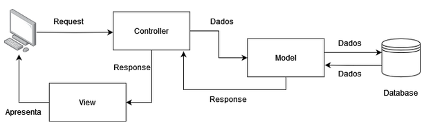
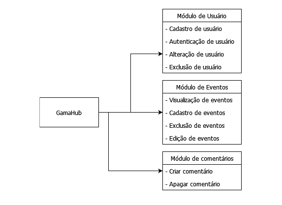
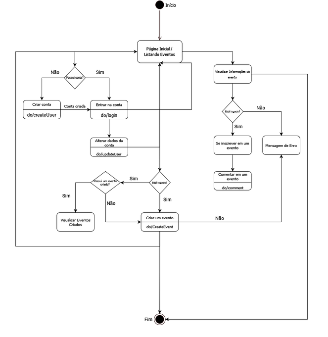
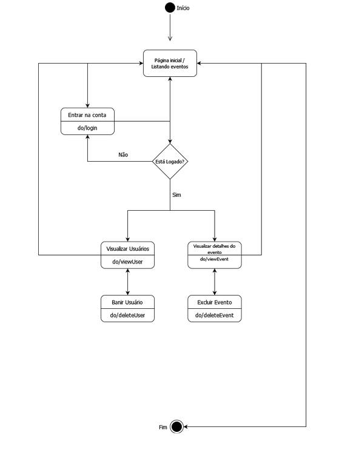
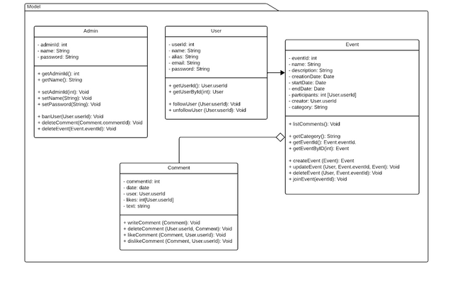
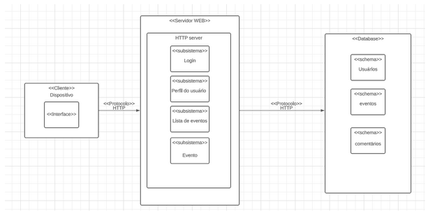

# Documento de Arquitetura v0.1

## Histórico de Revisão

### Versão 0.1

- Data: 03/11/2023
- Autores: Rodrigo, João Pedro, Manoel, Mateus
- Primeiras definições de escopo.

## Autores
<table>
  <tr>
   <td><strong>Matrícula</strong>
   </td>
   <td>
<strong>Nome</strong>
   </td>
   <td><strong>Descrição do papel assumido na equipe</strong>
   </td>
   <td><strong>% de contribuição ao trabalho (*)</strong>[^1]
   </td>
  </tr>
  <tr>
   <td>170161951
   </td>
   <td>Eduardo Rodrigues Levenhagem
   </td>
   <td>
   </td>
   <td>16.5%
   </td>
  </tr>
  <tr>
   <td>211063022
   </td>
   <td>Rodrigo Wendrel Ferreira 
   </td>
   <td>Scrum Master
   </td>
   <td>16.5%
   </td>
  </tr>
  <tr>
   <td>190058048
   </td>
   <td>Lara Giuliana Lima dos Santos
   </td>
   <td>
   </td>
   <td>16.5%
   </td>
  </tr>
  <tr>
   <td>200023535
   </td>
   <td>Manoel Castro Moura Filho
   </td>
   <td>
   </td>
   <td>16.5%
   </td>
  </tr>
  <tr>
   <td>200024825
   </td>
   <td>Mateus Santos Negrini
   </td>
   <td>
   </td>
   <td>16.5%
   </td>
  </tr>
  <tr>
   <td>211061940
   </td>
   <td>João Pedro Ferreira Alves
   </td>
   <td>
   </td>
   <td>16.5%
   </td>
  </tr>
</table>

## 1. Introdução

### 1. Propósito
Providenciar uma plataforma para aqueles interessados em participar de eventos ou grupos no FGA possam se encontrar e se comunicar, além de poderem cadastrar seus próprios evento

### 1.2 Escopo
O software se trata de uma aplicação web com o objetivo de permitir a integração dos alunos da Faculdade Gama por meio de atividades sociais que são anunciadas via aplicação.

## 2. Representação Arquitetural

### 2.1 Definições
O sistema seguirá uma arquitetura MVC, onde a aplicação é dividida em três camadas: Model, View e Controller. A camada Model (Modelo) é  responsável pela manipulação de dados, a camada View é a camada por onde o usuário irá interagir com a aplicação, por fim, a camada Controller é responsável por conectar a Model e a View, repassando as requisições da View para a Model, e repassando os resultados da Model para a View.

### 2.2. Justifique sua escolha. 
Escolhemos o MVC devido a sua modularização permitindo o desenvolvimento simultâneo de diversas partes do software além de oferecer flexibilidade para evoluir a aplicação já que, as alterações na Model não afetam a View e vice-versa, permitindo assim, uma manutenção mais simplificada. 

### 2.3 Detalhamento

##### Imagem 1: Diagrama de funcionamento da arquitetura MVC
  

### 2.4 Metas e restrições arquiteturais
As metas e restrições são definidas para guiar o time de desenvolvimento para entregar um produto de qualidade dentro do escopo. Nas tabelas abaixo estão registradas as metas e restrições assumidas pela equipe no projeto.

##### Tabela 1: Metas 

<table>
  <tr>
   <td>Metas
   </td>
   <td>Descrição
   </td>
  </tr>
  <tr>
   <td>Atuação
   </td>
   <td>capacidade de 100 usuários simultâneos.
   </td>
  </tr>
  <tr>
   <td>Segurança e confiabilidade
   </td>
   <td>Verificar se um usuário já foi cadastrado.
   </td>
  </tr>
  <tr>
   <td>Segurança e confiabilidade
   </td>
   <td>Não permitir que um usuário faça login em uma conta que não  lhe pertence.
   </td>
  </tr>
  <tr>
   <td>Segurança e confiabilidade
   </td>
   <td>Sistema de autenticação de e-mail.
   </td>
  </tr>
  <tr>
   <td>Segurança e confiabilidade
   </td>
   <td>Permitir a exclusão de posts somente por parte do autor ou do administradores.
   </td>
  </tr>
  <tr>
   <td>Manutenção
   </td>
   <td>Cada módulo deve ser independente de modo que seja possível alterar um sem necessariamente alterar toda a aplicação.
   </td>
  </tr>
  <tr>
   <td>Manutenção
   </td>
   <td>O site deve estar disponível para uso 24h por dia.
   </td>
  </tr>
</table>

##### Tabela 2: Restrições

<table>
  <tr>
   <td>Restrições
   </td>
   <td>Descrição
   </td>
  </tr>
  <tr>
   <td>Responsividade
   </td>
   <td>A aplicação deve ser adaptável e oferecer uma experiência consistente em todas as variedades de telas de smartphones.
   </td>
  </tr>
  <tr>
   <td>Acessibilidade
   </td>
   <td>A aplicação deve ter utilização intuitiva e simples.
   </td>
  </tr>
  <tr>
   <td>Idioma
   </td>
   <td>A aplicação deve ser desenvolvida para o idioma português do Brasil.
   </td>
  </tr>
  <tr>
   <td>Plataforma
   </td>
   <td>A aplicação será utilizada em navegadores web modernos e atualizados.
   </td>
  </tr>
  <tr>
   <td>Internet
   </td>
   <td>O usuário deverá estar conectado para utilizar a aplicação.
   </td>
  </tr>
</table>

### 2.5 Visão de Casos de uso (escopo do produto)
A aplicação visa facilitar a criação e divulgação de eventos na Faculdade do Gama, assim gerando maior interação dentro do campus. A aplicação web foi proposta para utilização por três perfis diferentes, o visitante, que acessa o site sem login, o usuário, que utiliza o site logado e o administrador, que possui poderes de curadoria em todo o site. Os visitantes podem visualizar os eventos disponíveis, os usuários podem criar e interagir com eventos, os administradores podem fazer tudo o que os usuários podem, além de banir usuários e deletar eventos ou comentários.

### 2.6 Visão lógica

##### Imagem 2: Diagrama de módulos
  

##### Imagem 3:  Diagrama de Estados(Usuário / Visitante)
  

##### Imagem 4:   Diagrama de Estados(Administrador)
  

##### Imagem 5:   Diagrama de Classes
  

### 2.7 Visão de Implementação

##### Tabela 3 - Visão de Implementação

<table>
  <tr>
   <td><strong>Visão de Implementação - </strong>Lógica de negócios e Regras de Negócio
   </td>
  </tr>
  <tr>
   <td>Administradores podem excluir perfis de usuário, postagens no fórum ou eventos que violem os Termos de Uso da aplicação *(Tabela de Regras Gerais).
   </td>
  </tr>
  <tr>
   <td>Cada perfil de usuário terá um login com senha, tendo seu e-mail verificado; Usuários sem um perfil criado poderão apenas visualizar, mas não interagir com os dados da aplicação.
   </td>
  </tr>
  <tr>
   <td>Cada usuário será capaz de fazer postagens no fórum, além de poder cadastrar eventos e endossar comentários com curtidas
   </td>
  </tr>
  <tr>
   <td>O perfil de visitante não terá permissão para fazer postagens nem qualquer tipo de interações, apenas visualizar 
   </td>
  </tr>
</table>

### 2.8 Visão de Implantação
  

* Front-end React: será implementado o front-end usando React, que será servido por meio de um servidor web Node.js. Será distribuído em servidores na nuvem
* Back-end Node.js: Nosso servidor Node.js atuará como a camada back-end
* Banco de Dados: O MongoDB, por conta de sua simplicidade de uso e aprendizado, será nosso banco de dados principal para armazenar e gerenciar os dados da aplicação web. Utilizaremos um cluster MongoDB gerenciado em um servidor na nuvem para garantir alta disponibilidade

### 2.9 Visão de Implantação
* É necessário o uso de um email da instituição ( UnB) para criação de conta e utilização da aplicação.

## 3. Bibliografia
HIRAMA, Kechi. Engenharia de Software: Qualidade e Produtividade com Tecnologia. Rio de Janeiro: GEN LTC, 2011. 232 p.

KOSCIANSKI, André; SOARES, Michel dos Santos. Qualidade de Software - 2ª edição: Aprenda as metodologias e técnicas. São Paulo: Novatec Editora, 2007. 395 p.
