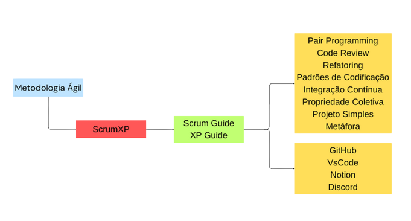

# Visão do Produto e do Projeto  v0.1.1

## Histórico de Revisão

### Versão 0.1
* Data: 02/10/2023
* Autor: [Rodrigo Wendrel](https://github.com/rodwendrel/)
* Reunião com foco em estruturar o documento e página de documentação com informações gerais do projeto.

### Versão 0.1
* Data: 03/11/2023
* Autor: Rodrigo, Manoel, João Mateus
* Revisão e alinhamento de todos os documentos

## 1. Visão Geral do Produto

### 1.1 Problema
Contexto: Dependências da Faculdade do Gama - UnB  
Problema: Falta de espaço próprio e unificado para interação entre alunos na Faculdade do Gama (FGA), considerando que o CA não tem espaço pra quase nada, onde possam ser anunciados evento remotos ou presenciais criados por alunos, tais como jogos de cartas e tabuleiros, eventos esportivos casuais e encontros em grupo fora das dependências da faculdade.
O aplicativo irá intermediar a organização de eventos entre estudantes.

### 1.2 Declaração de Posição do Produto
GamaHub se trata de uma aplicação web voltada para o corpo discente da Universidade de Brasília Faculdade Gama. Seu objetivo é gerar interação e inclusão entre os alunos por meio de eventos criados pelos mesmos. É uma forma fácil e simples de conhecer pessoas com interesses parecidos e assim, fazer novas relações que são necessárias e podem ser proveitosas dentro do meio acadêmico, pessoal e profissional.

##### Tabela 1 - Declaração de posição do produto

| | |
|---|---|
|Para|Estudantes do FGA|
|Necessidade|devido a falta de espaços físicos destinados para encontros para atividades de lazer|
|O|GamaHub|
|Que|Facilitar encontro de alunos do FGA para realizar atividades de lazer no FGA|
|Ao contrário|Amino|
|Nosso produto|É específico ao FGA|

### 1.3 Objetivos do Produto
O objetivo principal é criar um espaço para facilitar o encontro de pessoas com interesses específicos com outras de interesses similares dentro da FGA, além de ajudar a expandir a cultura e aproximar os estudantes.

### 1.4 Tecnologias a Serem Utilizadas
Será utilizado o método ágil ScrumXP, a stack Javascript, com NodeJS para o backend, a biblioteca React com framework NextJS, Notion e Suíte Google para organização de documentos e sprints. O ambiente de desenvolvimento será o VsCode.

## 2. Visão Geral do Projeto
### 2.1 Ciclo de Vida do Projeto de Desenvolvimento de Software
  
Considerando o contexto do projeto que é de uma aplicação sem muitos riscos envolvidos, o que não pede muito detalhamento de requisitos, e que o prazo é limitado, foi definido um ciclo de vida ágil, assim como os processos do ScrumXP, visando um produto de software que agrade os usuários e aceite mudanças de requisitos. As ferramentas utilizadas na organização foram o Notion, GitHub e Discord, onde os membros podem organizar códigos, fazer reuniões e registrar o progresso das sprints.

### 2.2 Organização do Projeto
| Papel | Atribuições | Responsáveis | Participantes
|---|---|---|---|
|Desenvolvedor | Codificar o produto, codificar testes unitários, realizar refatoração. | Manoel | João, Lara, Manoel,  Rodrigo, Eduardo |
|Dono do Produto | Atualizar o escopo do produto, organizar o escopo das sprints, validar as entrega | Manoel | João, Lara, Manoel,  Rodrigo Eduardo |
|Scrum Master | Garantir a qualidade do produto, garantir o cumprimento do conceito de pronto, realizar inspeções de código | Rodrigo | Rodrigo |
|Cliente | Estudantes da FGA | Estudantes da FGA | Estudantes da FGA |

### 2.3 Planejamento das Fases e/ou Iterações do Projeto
|Sprint|Produto (Entrega)|Data Início|Data Fim|Entregáveis|Responsáveis|% conclusão|
|---|---|---|---|---|---|---|
|Sprint 1|Definição do Produto|11/09/2023|02/10/2023|(*)|Todos os membros do grupo|10%|
|Sprint 2|MVP e Planejamento do Projeto|02/10/2023|03/11/2023|Documentação de Visão, Escopo e Arquitetura|Todos os membros do grupo|15%|
|Sprint 3|Protótipo e capacitação nas tecnologias|06/10/2023|12/11/2023|Protótipo, e atividades de desenvolvimento|Todos os membros do grupo|10%|

### 2.4 Matriz da Comunicação
| Descrição | Área/Envolvidos | Periodicidade | Produtos Gerados
|---|---|---|---|
|Comunicar situação do projeto | Equipe | Diariamente | Ata de reunião básica |
|Acompanhamento das Atividades em Andamento | Equipe do Projeto   Prof/Monitor | Semanal | Ata de reunião   Relatório de situação do projeto |
|Acompanhamento dos Riscos, Compromissos, Ações Pendentes, Indicadores | Equipe do Projeto | Semanal | Ata de reunião   Relatório de situação |

### 2.5 Gerenciamento de Riscos
| Risco | Grau de Exposição | Mitigação | Plano de contigência
|---|---|---|---|
|Diminuição da equipe trancamentos ou situações inesperadas | Baixa | Manter comunicação constante | Redistribuir tarefas e reavaliar escopo do projeto |
|Insuficiência da capacidade técnica da equipe | Médio | Pair programming com pessoas mais experientes | Pair programming |
|Perda de equipamentos e material de trabalho |Baixo |Manter cuidados de rotina |Utilizar material emprestado - biblioteca ou em pair programming |
|Má avaliação do escopo do projeto |Médio |Recorrer a monitores e ao professor para avaliação do backlog |Reavaliar requisitos rapidamente |
|Perda de contato com clientes e PO |Médio |Manter comunicação constante |Recorrer a outras pessoas que possam se encaixar no perfil de usuários |
|Falhas de comunicação entre membros da equipe |Alto |Manter comunicação constante |Buscar pessoas ausentes e auxílio na gestão de equipes |
|Dificuldade de encontrar horários comuns |Médio |Aproveitar o máximo possível os horários de aulas e pós-expediente |Flexibilizar a forma de comunicação para assíncrona e manter todos sempre cientes da situação do projeto|
|A qualidade do software não corresponder às expectativas do cliente |Médio |Verificar constantemente a validade do projeto |Buscar entender melhor as necessidades do cliente e refatorar o produto; reavaliar escopo |
As atividades não forem concretizadas no prazo |Médio |Manter acompanhamento do trabalho e os processos do ScrumXP |Aumentar carga de trabalho; reavaliar escopo do projeto |

### 2.6 Critérios de Replanejamento
* Diminuição da equipe (trancamentos ou situações inesperadas);
* Má avaliação do escopo do projeto
* A qualidade do software não corresponder às expectativas do cliente
* As atividades não forem concretizadas no prazo

## 3. Processo de Desenvolvimento de Software
* Sprint: 1 semana
* Planejamento: no início de cada sprint
* Retrospectiva e review: ao final de cada sprint
* Daily: diariamente através de meio de comunicação que seja rápida

## 4. Detalhamento de Atividades do Projeto
### 4.1 Atividade 1

|Atividade|Método|Ferramenta|Entrega|
|---|---|---|---|
|Codificação|Pair programming| Chat por voz / VsCode / Live Coding | Função definida na sprint|

### 4.2 Atividade 2
|Atividade|Método|Ferramenta|Entrega|
|---|---|---|---|
|Revisão|Pair review| Chat por voz / VsCode / Live Coding |Código revisado e validado|

### 4.3 Atividade 3
|Atividade|Método|Ferramenta|Entrega|
|---|---|---|---|
|Documentação|(*)|Google Docs / MkDocs |Documento|

### 4.4 Atividade 4
|Atividade|Método|Ferramenta|Entrega|
|---|---|---|---|
|Testes|Testes de integração / Unitários|A definir|Relatório de testes|

## 5. Lições Aprendidas
### 5.1 Unidade 1
Estruturação de documentos, colaboração e organização em equipe. 

### 5.2 Unidade 2
//
### 5.3 Unidade 3
//
### 5.4 Unidade 4
//

## 6. Próximos Passos
* Prototipação do produto;
* Capacitação da equipe;
* Codificação do projeto;

## 7. Referências Bibliográficas
//
